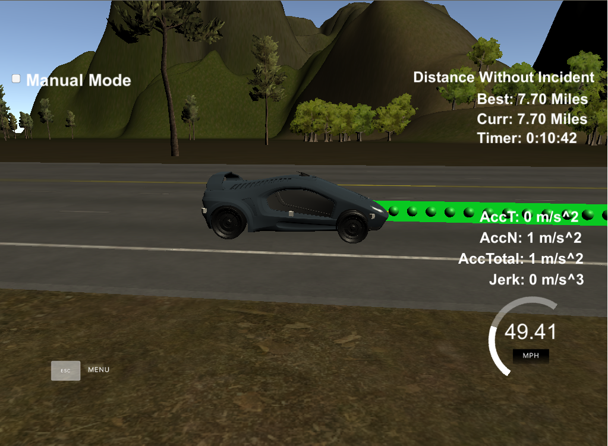
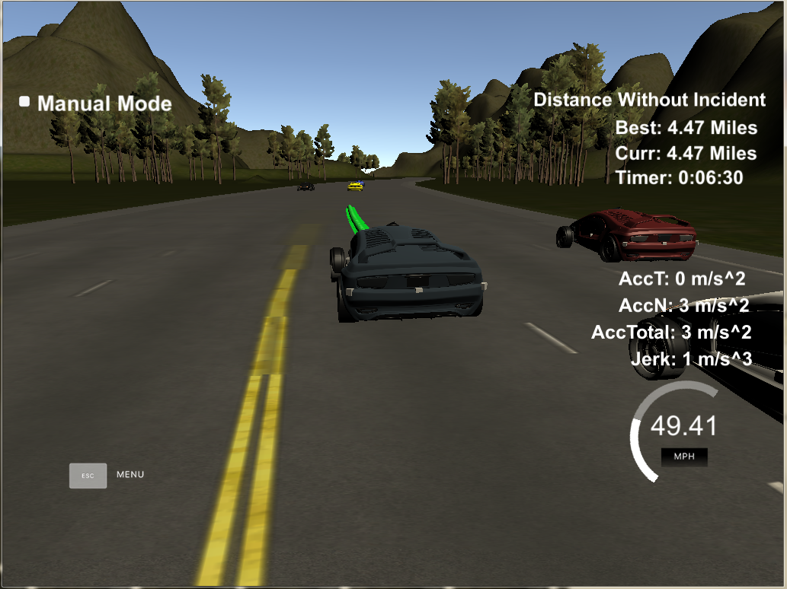
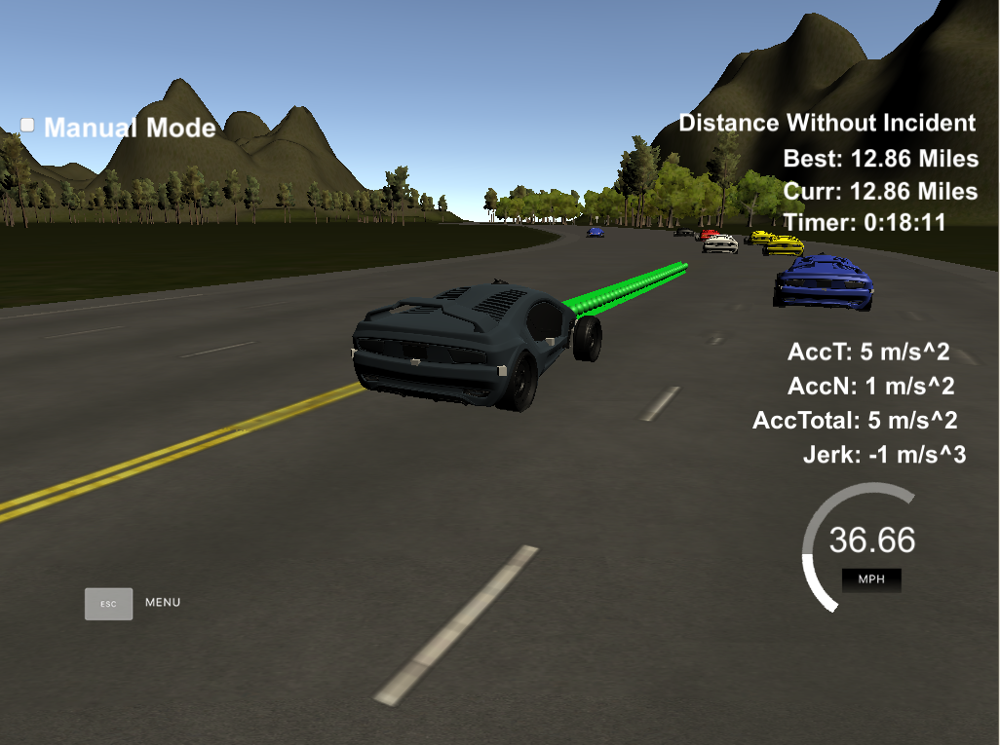
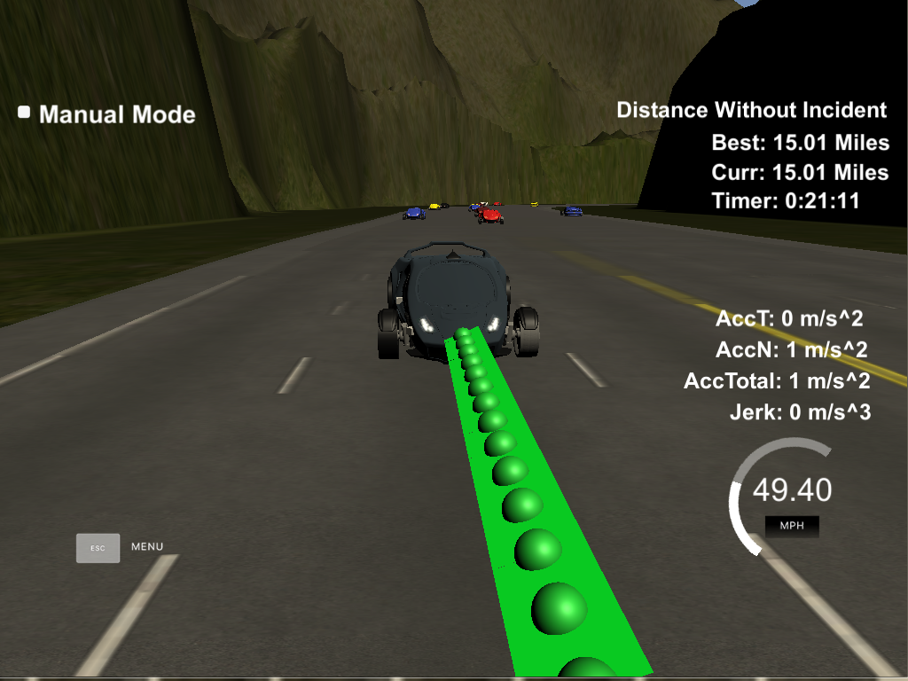
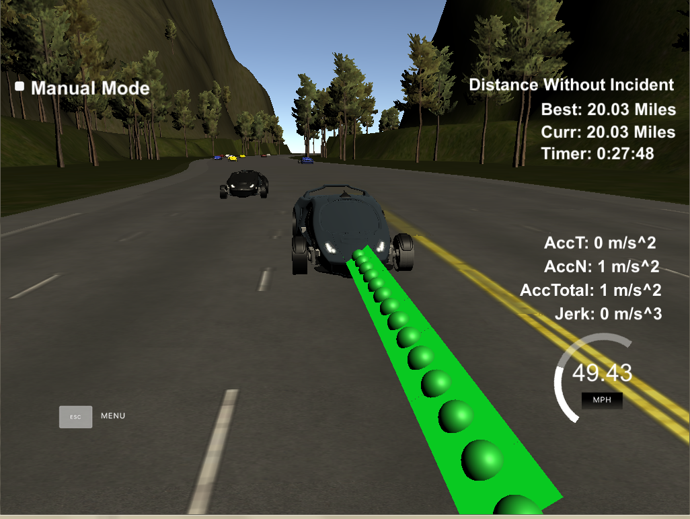

# CarND-Path-Planning-Project
[](http://www.udacity.com/drive)


# Project Goals
---
The goal of this project are the following:

* Build a Trajectory planner for highway driving condition.
* Plan trajectory such that there is no excessive jerk(< 10 m/s^2) and no collision with other vehicles in the simulator.
* Get as close to Max velocity of 50 mph.
* Change lanes when there is traffic ahead and it is safe to change lane.
* Summarize the results with a written report.

 *Path Planning*


# Overview of the Project
---
In this project, the goal is to design a path planner that is able to create smooth, safe paths for the car to follow along a 3 lane highway with traffic. A successful path planner will be able to keep inside its lane, avoid hitting other cars, and pass slower moving traffic all by using localization, sensor fusion, and map data.

The highway traffic is simulated using udacity term 3 [simulator](https://github.com/udacity/self-driving-car-sim/releases/tag/T3_v1.2).

There are 3 components to a path planner:
1. Prediction: Predicting where the other vehicles (and other dynamic) will be in future (planning) time horizon
2. Behavior Planning: Behavior expected of the Ergo vehicle (Keep lane,Lane change left/Lane change right)
3. Trajectory generation: Generate a trajectory for Ergo vehicle based on criterion such as comfort, efficiency, maintain safe distance etc.


In this project, the path planning task is for a highway driving condition which makes prediction and behavior planning task simpler as only dynamic objects to consider are other vehicles. Using a [spline.h](http://kluge.in-chemnitz.de/opensource/spline) library and taking couple of points from previous trajectory while generating new trajectory makes the Trajectory generation task easier as by adjusting parameters of spline anchor points jerk can be minimized to within spec of the project.


# Steps in Path Planning Project
---

1. Using sensor fusion data available from simulator, find location of "other" vehicles
2. Find out lane of each of the cars reported by sensor fusion data 
3. Predict where the "other" cars are going to be at the end of current planned trajectory (current\_s + speed \* sim\_update\_period \* length\_of\_remaining\_previous\_trajectory )
4. If the Ergo vehicle is too close to vehicle (in the same lane as Ergo) in front, check if lane change, left or right is possible. If there are no vehicles ahead in the same lane as Ergo, increase speed of to the limit of max_speed (49.5 mph) with acceleration of about 5 m/s^2 increments.
5. If Lane change possible prepare for lane change else reduce the Ergo's speed by about 5 m/s^2 in steps.
6. Using points from previous trajectory and generating anchor points, use spline library to generate  a total of 50 points in new trajectory to pass to the simulator.


# Implementation
---

The implementation in this submission is quite simplistic without use of cost function.
The code base is based on example provided in class room.

## Prediction

The sensor fusion data is used to find if the Ergo vehicle has any vehicle in front within 30 meter distance (s) in the same lane (d) of it. Also, if the left lane and right lanes have vehicles closer than 30 meter in front or 15 meter behind for the time horizon of current trajectory.

## Behavior Planning

If the Ergo is too close (within 30 meter of vehicle in front), and either of the left of the current lane or right of the current lane are available (found from prediction step), then change lane. If the left or right lanes are not available, Keep the current lane reduce speed of the vehicle.

If there is no vehicle in the same lane with in 30 meters range (too close), gradually increase speed of the vehicle with 5 m/s^2 acceleration to the limit of target velocity (set at 49.5 mph)

## Trajectory Generation

spline library is used for trajectory generation. 2 points from previous trajectory is used as anchor point for spline. 3 new anchor points are generated with each point 30 meter away from car's current s coordinate. helper function a used to transform Frenet coordinates to cartesian coordinates.

The anchor points are transformed to be car's local co-ordinates, this avoids multiple y values for x and makes the calculations easy.

Using anchor points a spline object is created. 
Points remaining from previous path is filled in to the x and y points to be passed to simulator, additional x/y points is generated using spline interpolation to make the x/y vector size to 50.Since the additional points are created w.r.t. car's local coordinates they are then transformed to global coordinates before adding to x/y vector.


# Result
---

## here are the points from the Project Rubric


### The Car is able to drive without incident for more than 4.32 miles



*It took about 6 minutes to travel 4.9 miles*

### The car is able to change lanes

Lanes changes can be seen in the image below:

**Left lane change**


**Right lane change**


### The car drives according to the speed limit

Speed Maxout at 49.5 mph and speed reduces while in keep lane state when lane change is not safe


### Max Acceleration and Jerk are not Exceeded

### Car does not have collisions

### The car stays in its lane, except for the time between changing lanes.

For all the above points the simulator shall issue a warning, as can be seen in image below there is no warning for speed or collision.





### The car has been tested to drive incident free for > 15 miles in simulator





   


# Source Code, Compilation and Run
--- 
To compile and run the PathPlanning project code, following steps are required:

1. Make a build directory: `mkdir build && cd build`
2. Compile: `cmake .. && make`
3. Run it: `./path_planning`.
4. open term3 Simulator, select project  and run


# Future work and Improvements

The implementation is very simplistic, here are the improvements that can be made to generalize the path planning project.

1. Use of Cost function in the behavioral planning phase (Prepare lane change state)
2. Generate multiple trajectories and choose the one with smallest cost.
3. Consider acceleration and lane change of other vehicles in prediction stage.


#####################################################################################
---

# Details from base README

## Goals
In this project your goal is to safely navigate around a virtual highway with other traffic that is driving +-10 MPH of the 50 MPH speed limit. You will be provided the car's localization and sensor fusion data, there is also a sparse map list of waypoints around the highway. The car should try to go as close as possible to the 50 MPH speed limit, which means passing slower traffic when possible, note that other cars will try to change lanes too. The car should avoid hitting other cars at all cost as well as driving inside of the marked road lanes at all times, unless going from one lane to another. The car should be able to make one complete loop around the 6946m highway. Since the car is trying to go 50 MPH, it should take a little over 5 minutes to complete 1 loop. Also the car should not experience total acceleration over 10 m/s^2 and jerk that is greater than 10 m/s^3.

#### The map of the highway is in data/highway_map.txt
Each waypoint in the list contains  [x,y,s,dx,dy] values. x and y are the waypoint's map coordinate position, the s value is the distance along the road to get to that waypoint in meters, the dx and dy values define the unit normal vector pointing outward of the highway loop.

The highway's waypoints loop around so the frenet s value, distance along the road, goes from 0 to 6945.554.

## Basic Build Instructions

1. Clone this repo.
2. Make a build directory: `mkdir build && cd build`
3. Compile: `cmake .. && make`
4. Run it: `./path_planning`.

Here is the data provided from the Simulator to the C++ Program

#### Main car's localization Data (No Noise)

["x"] The car's x position in map coordinates

["y"] The car's y position in map coordinates

["s"] The car's s position in frenet coordinates

["d"] The car's d position in frenet coordinates

["yaw"] The car's yaw angle in the map

["speed"] The car's speed in MPH

#### Previous path data given to the Planner

//Note: Return the previous list but with processed points removed, can be a nice tool to show how far along
the path has processed since last time. 

["previous_path_x"] The previous list of x points previously given to the simulator

["previous_path_y"] The previous list of y points previously given to the simulator

#### Previous path's end s and d values 

["end_path_s"] The previous list's last point's frenet s value

["end_path_d"] The previous list's last point's frenet d value

#### Sensor Fusion Data, a list of all other car's attributes on the same side of the road. (No Noise)

["sensor_fusion"] A 2d vector of cars and then that car's [car's unique ID, car's x position in map coordinates, car's y position in map coordinates, car's x velocity in m/s, car's y velocity in m/s, car's s position in frenet coordinates, car's d position in frenet coordinates. 

## Details

1. The car uses a perfect controller and will visit every (x,y) point it recieves in the list every .02 seconds. The units for the (x,y) points are in meters and the spacing of the points determines the speed of the car. The vector going from a point to the next point in the list dictates the angle of the car. Acceleration both in the tangential and normal directions is measured along with the jerk, the rate of change of total Acceleration. The (x,y) point paths that the planner recieves should not have a total acceleration that goes over 10 m/s^2, also the jerk should not go over 50 m/s^3. (NOTE: As this is BETA, these requirements might change. Also currently jerk is over a .02 second interval, it would probably be better to average total acceleration over 1 second and measure jerk from that.

2. There will be some latency between the simulator running and the path planner returning a path, with optimized code usually its not very long maybe just 1-3 time steps. During this delay the simulator will continue using points that it was last given, because of this its a good idea to store the last points you have used so you can have a smooth transition. previous_path_x, and previous_path_y can be helpful for this transition since they show the last points given to the simulator controller with the processed points already removed. You would either return a path that extends this previous path or make sure to create a new path that has a smooth transition with this last path.

## Tips

A really helpful resource for doing this project and creating smooth trajectories was using http://kluge.in-chemnitz.de/opensource/spline/, the spline function is in a single header file is really easy to use.

---

## Dependencies

* cmake >= 3.5
  * All OSes: [click here for installation instructions](https://cmake.org/install/)
* make >= 4.1
  * Linux: make is installed by default on most Linux distros
  * Mac: [install Xcode command line tools to get make](https://developer.apple.com/xcode/features/)
  * Windows: [Click here for installation instructions](http://gnuwin32.sourceforge.net/packages/make.htm)
* gcc/g++ >= 5.4
  * Linux: gcc / g++ is installed by default on most Linux distros
  * Mac: same deal as make - [install Xcode command line tools]((https://developer.apple.com/xcode/features/)
  * Windows: recommend using [MinGW](http://www.mingw.org/)
* [uWebSockets](https://github.com/uWebSockets/uWebSockets)
  * Run either `install-mac.sh` or `install-ubuntu.sh`.
  * If you install from source, checkout to commit `e94b6e1`, i.e.
    ```
    git clone https://github.com/uWebSockets/uWebSockets 
    cd uWebSockets
    git checkout e94b6e1
    ```

## Editor Settings

We've purposefully kept editor configuration files out of this repo in order to
keep it as simple and environment agnostic as possible. However, we recommend
using the following settings:

* indent using spaces
* set tab width to 2 spaces (keeps the matrices in source code aligned)

## Code Style

Please (do your best to) stick to [Google's C++ style guide](https://google.github.io/styleguide/cppguide.html).


## Call for IDE Profiles Pull Requests

Help your fellow students!

We decided to create Makefiles with cmake to keep this project as platform
agnostic as possible. Similarly, we omitted IDE profiles in order to ensure
that students don't feel pressured to use one IDE or another.

However! I'd love to help people get up and running with their IDEs of choice.
If you've created a profile for an IDE that you think other students would
appreciate, we'd love to have you add the requisite profile files and
instructions to ide_profiles/. For example if you wanted to add a VS Code
profile, you'd add:

* /ide_profiles/vscode/.vscode
* /ide_profiles/vscode/README.md

The README should explain what the profile does, how to take advantage of it,
and how to install it.

Frankly, I've never been involved in a project with multiple IDE profiles
before. I believe the best way to handle this would be to keep them out of the
repo root to avoid clutter. My expectation is that most profiles will include
instructions to copy files to a new location to get picked up by the IDE, but
that's just a guess.

One last note here: regardless of the IDE used, every submitted project must
still be compilable with cmake and make./


